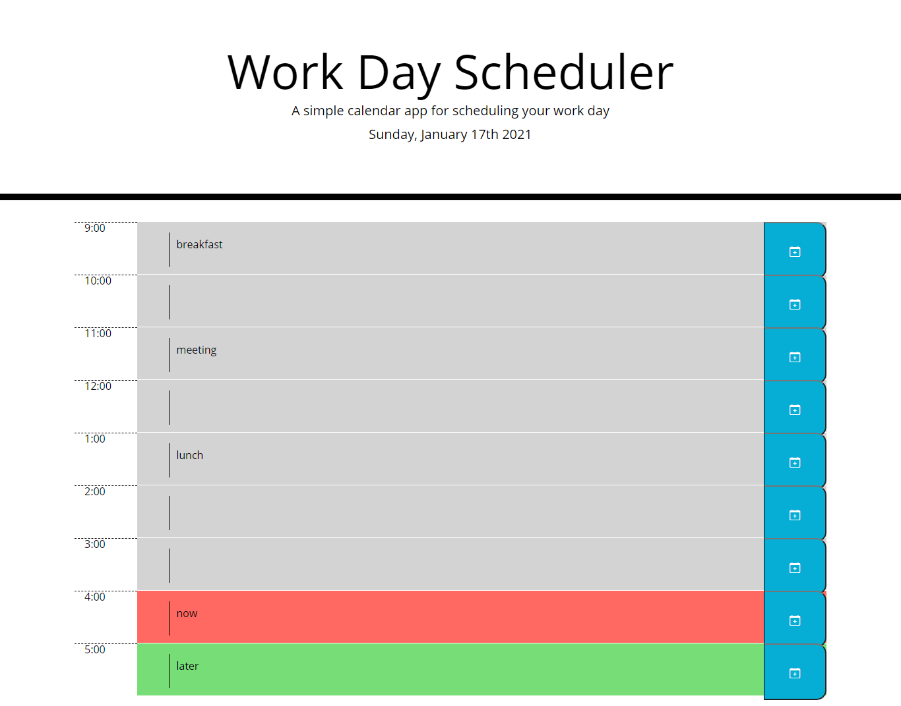

# Workday Scheduler

## Description 

In this project, I modified a starter code using jQuery to create a calendar application that allows the user to see the current time and save tasks that persist once the page is refreshed. This project uses the Moment.js library. 

## Screenshot 

The following image shows the application:

## URL

[Workday Scheduler](https://alishasaleh.github.io/workday-scheduler/)

## License

Standard MIT License

